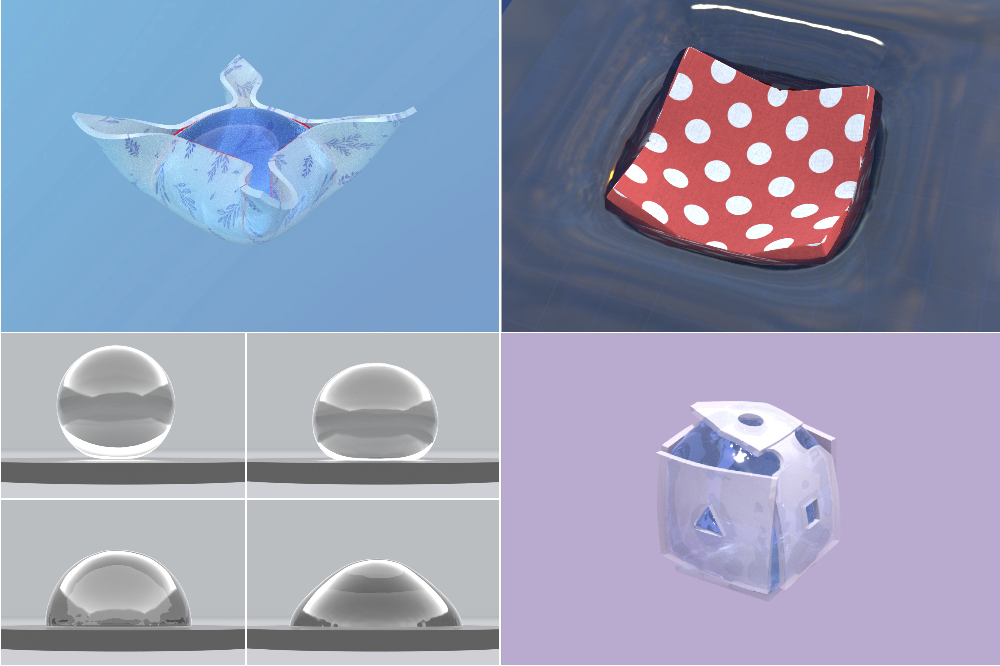
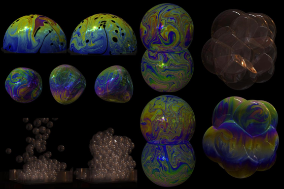

  

    
  

  

    <h1>Mengdi Wang (王梦迪)</h1>
    PhD Student
     
    School of IC, Georgia Institute of Technology
     
    3142 Klaus Building
     
    Email: mengdi.wang@gatech.edu
     
    <a href="./resume.pdf" target="_blank" rel="noopener noreferrer">Resume</a> |
    <a href="https://scholar.google.com/citations?user=-5AeATsAAAAJ" target="_blank" rel="noopener noreferrer">Google Scholar</a> |
    <a href="https://www.linkedin.com/in/mengdi-wang-cg/" target="_blank" rel="noopener noreferrer">LinkedIn</a> |
    <a href="https://github.com/wang-mengdi" target="_blank" rel="noopener noreferrer">GitHub</a>
  

## About Me
I am a PhD student at Georgia Tech in the School of Interactive Computing, majoring in Computer Science with a research focus on physics-based simulation, advised by Prof. [Bo Zhu](https://faculty.cc.gatech.edu/~bozhu/). I received my Bachelor degree of Computer Science at Peking University in 2020, advised by Prof. [Baoquan Chen](https://cfcs.pku.edu.cn/baoquan/). 

My overarching research goal is to empower diverse fields such as scientific discovery, video generation AI, and game visual effects through high-performance, large-scale GPU-based physical simulations. To this end, my work involves the development of novel numerical algorithms for simulating both large-scale physical phenomena on GPUs and complex geometric fluids, leading to multiple publications at top venues including SIGGRAPH and the Journal of Computational Physics (JCP).

**I anticipate graduating in June 2026 and am actively seeking Postdoctoral and Research Scientist positions. Please feel free to reach out to discuss potential opportunities.**

Contributed open-source projects:  

## Publications

[**Cirrus: Adaptive Hybrid Particle-Grid Flow Maps on GPU**](./proj/25-cirrus/)
 

 
ACM Transactions on Graphics (Proceedings of SIGGRAPH 2025)
 
[**Mengdi Wang**](./), [Fan Feng](https://sking8.github.io/), Junlin Li, [Bo Zhu](https://faculty.cc.gatech.edu/~bozhu/)

 
 

[**Real-Time Knit Deformation and Rendering**](https://kuiwuchn.github.io/rtstitch.html)
 

 
ACM Transactions on Graphics (Proceedings of SIGGRAPH 2025)
 
[Tao Huang\*](https://dcjmj.github.io/), [Haoyang Shi\*](https://luke-skycrawler.github.io/), [**Mengdi Wang**\*](./), [Yuxing Qiu](https://yuxingqiu.github.io/), [Yin Yang](https://yangzzzy.github.io/), [Kui Wu](https://kuiwuchn.github.io/)

 
 

[**An interface tracking method with triangle edge cuts**](./proj/triangle-edge-cuts)
 

 
[**Mengdi Wang**](./), [Matthew Cong](https://physbam.stanford.edu/~mdcong/), [Bo Zhu](https://faculty.cc.gatech.edu/~bozhu/)  
 
Journal of Computational Physics (Volume 520, 1 January 2025, 113504)

 
 

[**Hydrophobic and Hydrophilic Solid-Fluid Interaction**](https://dl.acm.org/doi/10.1145/3550454.3555478)
 

 
[Jinyuan Liu](https://jinyuan-liu.github.io), [**Mengdi Wang**](./), [Fan Feng](https://sking8.github.io/), [Annie Tang](http://annietang.me/), [Qiqin Le](https://lqqqqq.blogspot.com/), [Bo Zhu](https://faculty.cc.gatech.edu/~bozhu/)
 
ACM Transactions on Graphics (Proceedings of SIGGRAPH Asia 2022)

 
 

[**A Clebsch method for free-surface vortical flow simulation**](https://shiyingxiong.github.io/proj/Clebsch/Clebsch)
 

 
ACM Transactions on Graphics (Proceedings of SIGGRAPH 2022)
 
[Shiying Xiong](https://shiyingxiong.github.io/), Zhecheng Wang, [**Mengdi Wang**](./), [Bo Zhu](https://faculty.cc.gatech.edu/~bozhu/)

 
 

[**A Moving Eulerian-Lagrangian Particle Method for Thin Film and Foam Simulation**](https://yitongdeng.github.io/MELP_Project.github.io/)
 

 
ACM Transactions on Graphics (Proceedings of SIGGRAPH 2022)
 
[Yitong Deng](https://yitongdeng.github.io/), [**Mengdi Wang**](./), Xiangxin Kong, [Shiying Xiong](https://shiyingxiong.github.io/), Zangyueyang Xian, [Bo Zhu](https://faculty.cc.gatech.edu/~bozhu/)

 
 

[**Thin-Film Smoothed Particle Hydrodynamics Fluid**](./proj/thin-film-sph/)
 

 
ACM Transactions on Graphics (Proceedings of SIGGRAPH 2021)
 
[**Mengdi Wang**](./), [Yitong Deng](https://yitongdeng.github.io/), Xiangxin Kong, Aditya H. Prasad, [Shiying Xiong](https://shiyingxiong.github.io/), [Bo Zhu](https://faculty.cc.gatech.edu/~bozhu/)

 
 

[**Visual Data Analysis and Simulation Prediction for COVID-19**](https://arxiv.org/abs/2002.07096v3/)
 

 
Published in arXiv preprint, 2020
 
[Baoquan Chen](https://cfcs.pku.edu.cn/baoquan/), [Mingyi Shi](https://rubbly.cn/), [Xingyu Ni](https://starryuniv.cn), [Liangwang Ruan](https://lwruan.com/), [Hongda Jiang](https://jianghd1996.github.io/), Heyuan Yao, [**Mengdi Wang**](./), Zhenhua Song, Qiang Zhou, Tong Ge.

## Experience

**Game Engine Research Intern**
 
TikTok Inc.
 
San Jose, CA
 
2025.5 ~ Present

 

**Research Intern**
 
Lightspeed Studio, Tencent America
 
Los Angeles, CA
 
2024.5 ~ 2024.8

 

**Research Intern**
 
NVIDIA Research
 
Santa Clara, CA (remote)
 
2022.6 ~ 2022.9