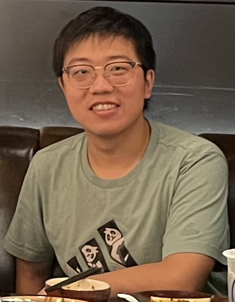
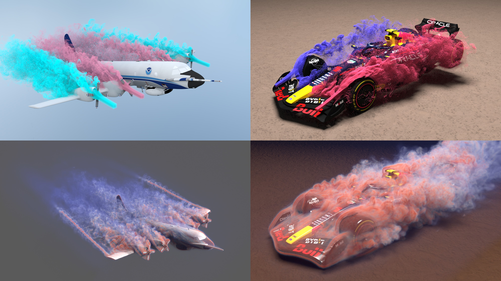
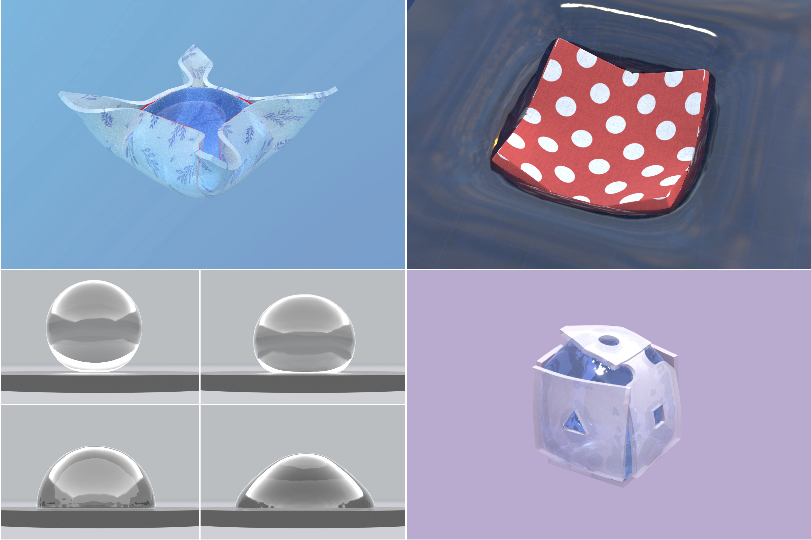
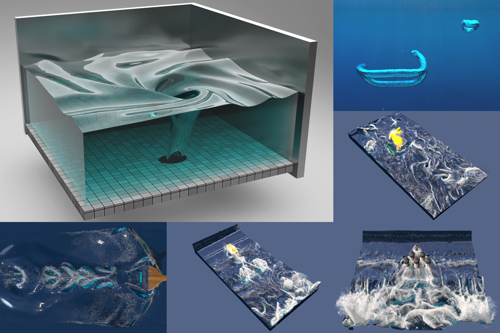

# Mengdi Wang (王梦迪) 
 
[mengdi.wang@gatech.edu](mengdi.wang@gatech.edu)

## About Me
I am a PhD student at Georgia Tech, advised by Prof. [Bo Zhu](https://faculty.cc.gatech.edu/~bozhu/). I received my Bachelor degree of Computer Science at Peking University in 2020, advised by Prof. [Baoquan Chen](https://cfcs.pku.edu.cn/baoquan/).

My research focuses on physics-based simulation. I develop high-performance GPU algorithms to achieve accurate physical simulations on consumer-grade hardware that previously required supercomputers, enabling advancements in scientific research, computer-aided engineering, and virtual reality applications. My work spans adaptive-resolution high-performance GPU algorithms, high-precision interface tracking, and novel low-dissipation numerical schemes.

 

## Publications

[**Cirrus: Adaptive Hybrid Particle-Grid Flow Maps on GPU**](./proj/25-cirrus/)
 
ACM Transactions on Graphics (Proceedings of SIGGRAPH 2025)
 
[**Mengdi Wang**](https://wang-mengdi.github.io/), [Fan Feng](https://sking8.github.io/), Junlin Li, [Bo Zhu](https://faculty.cc.gatech.edu/~bozhu/)
 

 
 

[**Real-Time Knit Deformation and Rendering**](https://kuiwuchn.github.io/rtstitch.html)
 
ACM Transactions on Graphics (Proceedings of SIGGRAPH 2025)
 
[Tao Huang\*](https://dcjmj.github.io/), [Haoyang Shi\*](https://luke-skycrawler.github.io/), [**Mengdi Wang**\*](https://wang-mengdi.github.io/), [Yuxing Qiu](https://yuxingqiu.github.io/), [Yin Yang](https://yangzzzy.github.io/), [Kui Wu](https://kuiwuchn.github.io/)
 

 
 

[**An interface tracking method with triangle edge cuts**](./proj/triangle-edge-cuts)
 
Journal of Computational Physics (Volume 520, 1 January 2025, 113504)
 
[**Mengdi Wang**](https://wang-mengdi.github.io/), [Matthew Cong](https://physbam.stanford.edu/~mdcong/), [Bo Zhu](https://faculty.cc.gatech.edu/~bozhu/)  

 
 

**Hydrophobic and Hydrophilic Solid-Fluid Interaction**  
ACM Transactions on Graphics (Proceedings of SIGGRAPH Asia 2022)  
[Jinyuan Liu](https://jinyuan-liu.github.io), [**Mengdi Wang**](https://wang-mengdi.github.io/), [Fan Feng](https://sking8.github.io/), [Annie Tang](http://annietang.me/), [Qiqin Le](https://lqqqqq.blogspot.com/), [Bo Zhu](https://www.cs.dartmouth.edu/~bozhu/)  

 
 

**A Clebsch method for free-surface vortical flow simulation**  
ACM Transactions on Graphics (Proceedings of SIGGRAPH 2022)  
[Shiying Xiong](https://shiyingxiong.github.io/), Zhecheng Wang, [**Mengdi Wang**](https://wang-mengdi.github.io/), [Bo Zhu](https://www.cs.dartmouth.edu/~bozhu/)  
**[[paper](https://shiyingxiong.github.io/proj/Clebsch/Clebsch.pdf)]**  **[[webpage](https://shiyingxiong.github.io/proj/Clebsch/Clebsch)]**

 
 

 

**A Moving Eulerian-Lagrangian Particle Method for Thin Film and Foam Simulation**  
ACM Transactions on Graphics (Proceedings of SIGGRAPH 2022)  
[Yitong Deng](https://yitongdeng.github.io/), [**Mengdi Wang**](https://wang-mengdi.github.io/), Xiangxin Kong, [Shiying Xiong](https://shiyingxiong.github.io/), Zangyueyang Xian, [Bo Zhu](https://www.cs.dartmouth.edu/~bozhu/)  
**[[paper](https://cs.dartmouth.edu/~bozhu/papers/melp.pdf)]**  **[[webpage](https://yitongdeng.github.io/MELP_Project.github.io/)]**

 
 

**Thin-Film Smoothed Particle Hydrodynamics Fluid**  
ACM Transactions on Graphics (Proceedings of SIGGRAPH 2021)  
[**Mengdi Wang**](https://wang-mengdi.github.io/), Yitong Deng, Xiangxin Kong, Aditya H. Prasad, [Shiying Xiong](https://shiyingxiong.github.io/), [Bo Zhu](https://www.cs.dartmouth.edu/~bozhu/)  
**[[paper](https://cs.dartmouth.edu/~bozhu/papers/sph_bubble.pdf)]**  **[[webpage](https://wang-mengdi.github.io/proj/thin-film-sph/)]**

 
 

**Visual Data Analysis and Simulation Prediction for COVID-19**  
Published in arXiv preprint, 2020  
[Baoquan Chen](https://cfcs.pku.edu.cn/baoquan/), [Mingyi Shi](https://rubbly.cn/), [Xingyu Ni](https://starryuniv.cn), [Liangwang Ruan](https://lwruan.com/), [Hongda Jiang](https://jianghd1996.github.io/), Heyuan Yao, [**Mengdi Wang**](https://wang-mengdi.github.io/), Zhenhua Song, Qiang Zhou, Tong Ge.  
**[[paper](https://arxiv.org/ftp/arxiv/papers/2002/2002.07096.pdf)]**  **[[webpage](https://arxiv.org/abs/2002.07096v3/)]**
