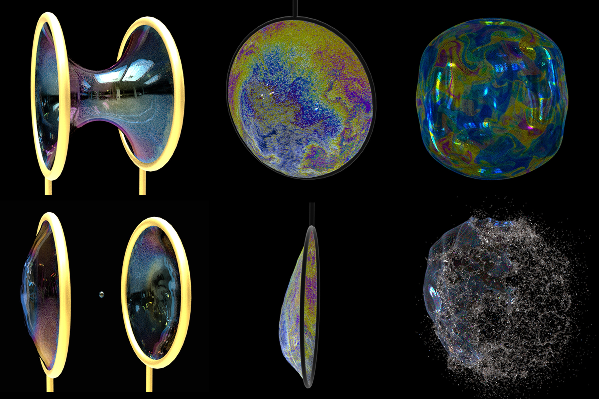

# Mengdi Wang (王梦迪)

[mengdi.wang@gatech.edu](mengdi.wang@gatech.edu)

## About Me
I am a PhD student at Georgia Tech, advised by Prof. [Bo Zhu](https://faculty.cc.gatech.edu/~bozhu/). My research focuses on simulating multi-phase fluid phenomena on complex geometries facilitated by high-performance GPU algorithms.

I received my Bachelor degree of Computer Science at Peking University in 2020, advised by Prof. [Baoquan Chen](https://cfcs.pku.edu.cn/baoquan/).

## Publications

**Hydrophobic and Hydrophilic Solid-Fluid Interaction**  
ACM Transactions on Graphics (SIGGRAPH Asia 2022)  
[Jinyuan Liu](https://jinyuan-liu.github.io), [**Mengdi Wang**](https://wang-mengdi.github.io/), [Fan Feng](https://sking8.github.io/), [Annie Tang](http://annietang.me/), [Qiqin Le](https://lqqqqq.blogspot.com/) and [Bo Zhu](https://www.cs.dartmouth.edu/~bozhu/)  
**[[paper](https://jinyuan-liu.github.io/files/liu2022hydro.pdf)]**  **[[webpage](https://jinyuan-liu.github.io/projects/2022hydro/)]**

 
 

**A Clebsch method for free-surface vortical flow simulation**  
ACM Transactions on Graphics (SIGGRAPH 2022)  
[Shiying Xiong](https://shiyingxiong.github.io/), Zhecheng Wang, [**Mengdi Wang**](https://wang-mengdi.github.io/), and [Bo Zhu](https://www.cs.dartmouth.edu/~bozhu/)  
**[[paper](https://shiyingxiong.github.io/proj/Clebsch/Clebsch.pdf)]**  **[[webpage](https://shiyingxiong.github.io/proj/Clebsch/Clebsch)]**

 
 

**A Moving Eulerian-Lagrangian Particle Method for Thin Film and Foam Simulation**  
ACM Transactions on Graphics (SIGGRAPH 2022)  
[Yitong Deng](https://yitongdeng.github.io/), [**Mengdi Wang**](https://wang-mengdi.github.io/), Xiangxin Kong, [Shiying Xiong](https://shiyingxiong.github.io/), Zangyueyang Xian and [Bo Zhu](https://www.cs.dartmouth.edu/~bozhu/)  
**[[paper](https://cs.dartmouth.edu/~bozhu/papers/melp.pdf)]**  **[[webpage](https://yitongdeng.github.io/MELP_Project.github.io/)]**

 
 

**Thin-Film Smoothed Particle Hydrodynamics Fluid**  
ACM Transactions on Graphics (SIGGRAPH 2021)  
[**Mengdi Wang**](https://wang-mengdi.github.io/), Yitong Deng, Xiangxin Kong, Aditya H. Prasad, [Shiying Xiong](https://shiyingxiong.github.io/),  and [Bo Zhu](https://www.cs.dartmouth.edu/~bozhu/)  
**[[paper](https://cs.dartmouth.edu/~bozhu/papers/sph_bubble.pdf)]**  **[[webpage](https://wang-mengdi.github.io/proj/thin-film-sph/)]**

 
 

**Visual Data Analysis and Simulation Prediction for COVID-19**  
Published in arXiv preprint, 2020  
[Baoquan Chen](https://cfcs.pku.edu.cn/baoquan/), [Mingyi Shi](https://rubbly.cn/), [Xingyu Ni](https://starryuniv.cn), [Liangwang Ruan](https://lwruan.com/), [Hongda Jiang](https://jianghd1996.github.io/), Heyuan Yao, [**Mengdi Wang**](https://wang-mengdi.github.io/), Zhenhua Song, Qiang Zhou, and Tong Ge.  
**[[paper](https://arxiv.org/ftp/arxiv/papers/2002/2002.07096.pdf)]**  **[[webpage](https://arxiv.org/abs/2002.07096v3/)]**
