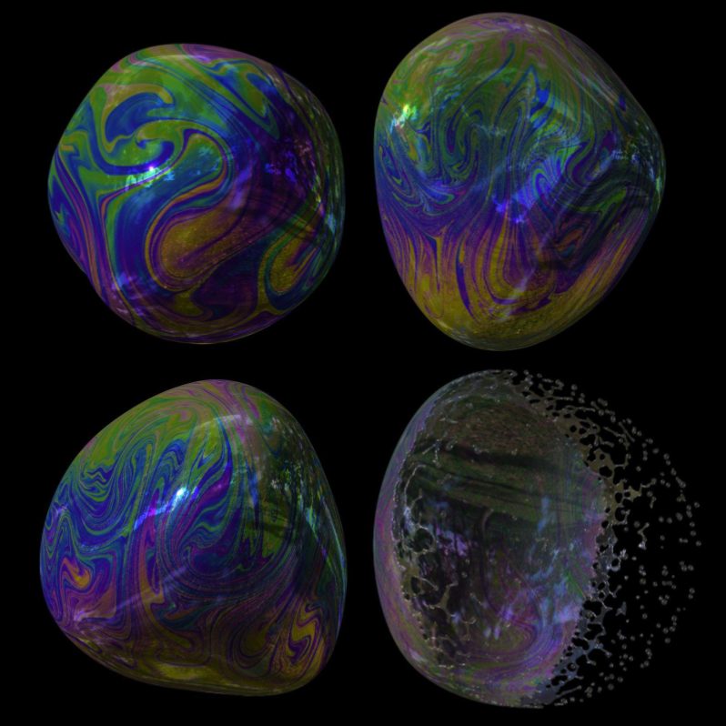

# A Moving Eulerian-Lagrangian Particle Method for Thin Film and Foam Simulation


[Yitong Deng<sup>1</sup>](https://yitongdeng.github.io/), [**Mengdi Wang<sup>1</sup>** ](https://wang-mengdi.github.io/), Xiangxin Kong<sup>1</sup>, [Shiying Xiong<sup>1</sup>](https://shiyingxiong.github.io/), Zangyueyang Xian<sup>1</sup> and [Bo Zhu<sup>1</sup>](https://www.cs.dartmouth.edu/~bozhu/)  
<sup>1</sup>Dartmouth College

## Paper

**A Moving Eulerian-Lagrangian Particle Method for Thin Film and Foam Simulation**  
ACM Transactions on Graphics (SIGGRAPH 2022)**
[Yitong Deng](https://yitongdeng.github.io/), [**Mengdi Wang**](https://wang-mengdi.github.io/), Xiangxin Kong, [Shiying Xiong](https://shiyingxiong.github.io/), Zangyueyang Xian and [Bo Zhu](https://www.cs.dartmouth.edu/~bozhu/)  
**[[paper](https://cs.dartmouth.edu/~bozhu/papers/melp.pdf)]**  **[[webpage](https://yitongdeng.github.io/MELP_Project.github.io/)]**
<br />
<br />

## Abstract

We present the Moving Eulerian-Lagrangian Particles (MELP), a novel mesh-free method for simulating incompressible fluid on thin films and foams. Employing a bi-layer particle structure, MELP jointly simulates detailed, vigorous flow and large surface deformation at high stability and efficiency. In addition, we design multi-MELP: a mechanism that facilitates the physically-based interaction between multiple MELP systems, to simulate bubble clusters and foams with non-manifold topological evolution. We showcase the efficacy of our method with a broad range of challenging thin film phenomena, including the Rayleigh-Taylor instability across double-bubbles, foam fragmentation with rim surface tension, recovery of the Plateau borders, Newton black films, as well as cyclones on bubble clusters.

## Video / Results

<iframe width="560" height="315" src="https://youtu.be/xW-G7hm6SWQ" title="YouTube video player" frameborder="0" allow="accelerometer; autoplay; clipboard-write; encrypted-media; gyroscope; picture-in-picture" allowfullscreen></iframe>

## Citation
```
@article{Deng2022MELP,
 title={A Moving Eulerian-Lagrangian Particle Method for Thin Film and Foam Simulation},
 author={Y. Deng and M. Wang and X. Kong and S. Xiong and Z. Xian and B. Zhu},
 journal={ACM Trans. Graph.},
 volume={41},
 number={4},
 article={154},
 year={2022}
} 
```
