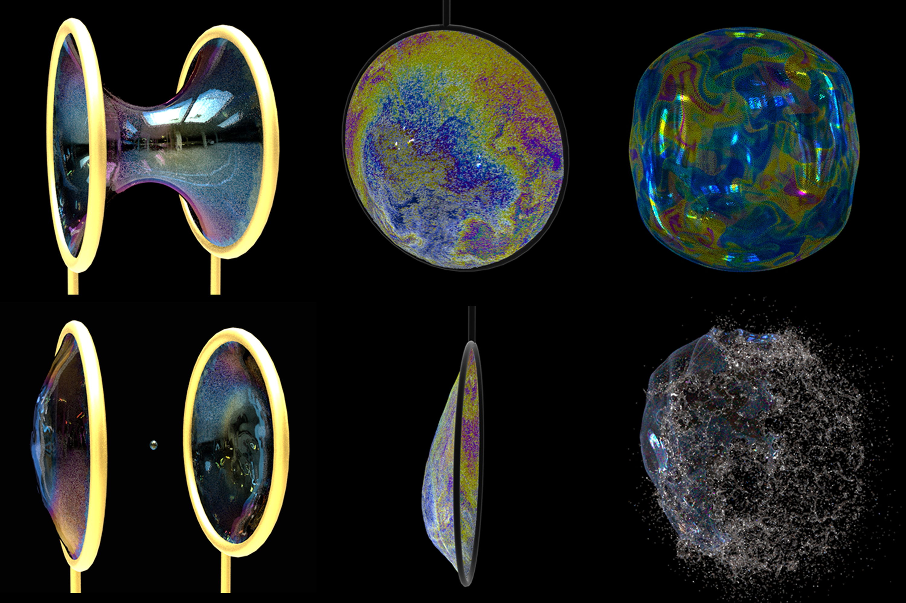

# Thin-Film Smoothed Particle Hydrodynamics Fluid


[Mengdi Wang<sup>1</sup>](https://wang-mengdi.github.io/), Yitong Deng<sup>1</sup>, Xiangxin Kong<sup>1</sup>, Aditya H. Prasad<sup>1</sup>, [Shiying Xiong<sup>1</sup>](https://shiyingxiong.github.io/),  and [Bo Zhu<sup>1</sup>](https://www.cs.dartmouth.edu/~bozhu/)  
<sup>1</sup>Dartmouth College

## Paper

**Thin-Film Smoothed Particle Hydrodynamics Fluid**  
ACM Transactions on Graphics (SIGGRAPH 2021)  
[Mengdi Wang](https://wang-mengdi.github.io/), Yitong Deng, Xiangxin Kong, Aditya H. Prasad, [Shiying Xiong](https://shiyingxiong.github.io/),  and [Bo Zhu](https://www.cs.dartmouth.edu/~bozhu/)  
**[[paper](https://cs.dartmouth.edu/~bozhu/papers/sph_bubble.pdf)]**  **[[webpage](https://wang-mengdi.github.io/proj/thin-film-sph/)]**
<br />

## Abstract

We propose a particle-based method to simulate thin-film fluid that jointly facilitates aggressive surface deformation and vigorous tangential flows. We build our dynamics model from the surface tension driven Navier-Stokes equation with the dimensionality reduced using the asymptotic lubrication theory and customize a set of differential operators based on the weakly compressible Smoothed Particle Hydrodynamics (SPH) for evolving pointset surfaces. The key insight is that the compressible nature of SPH, which is unfavorable in its typical usage, is helpful in our application to co-evolve the thickness, calculate the surface tension, and enforce the fluid incompressibility on a thin film. In this way, we are able to two-way couple the surface deformation with the in-plane flows in a physically based manner. We can simulate complex vortical swirls, fingering effects due to Rayleigh-Taylor instability, capillary waves, Newton’s interference fringes, and the Marangoni effect on liberally deforming surfaces by presenting both realistic visual results and numerical validations. The particle-based nature of our system also enables it to conveniently handle topology changes and codimension transitions, allowing us to marry the thin-film simulation with a wide gamut of 3D phenomena, such as pinch-off of unstable catenoids, dripping under gravity, merging of droplets, as well as bubble rupture.


## Video / Results

<iframe width="560" height="315" src="https://www.youtube.com/embed/__1VjKF-gTk" title="YouTube video player" frameborder="0" allow="accelerometer; autoplay; clipboard-write; encrypted-media; gyroscope; picture-in-picture" allowfullscreen></iframe>

## Citation
```
@article{wang2021thin,
  title={Thin-Film Smoothed Particle Hydrodynamics Fluid},
  author = {Mengdi Wang and Yitong Deng and Xiangxin Kong and Aditya H. Prasad and Shiying Xiong and Bo Zhu},
  itle = {Thin-Film Smoothed Particle Hydrodynamics Fluid},
  journal={ACM Transactions on Graphics (TOG)},
  volume={40},
  number={4},
  pages={1--16},
  year={2021},
  publisher={ACM},
  address = {New York, NY, USA}
}
```
