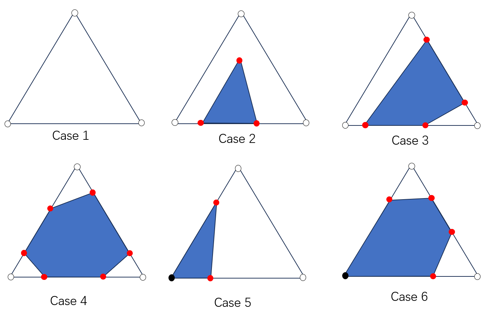

# An Interface Tracking Method with Triangle Edge Cuts

[Mengdi Wang<sup>1</sup>](https://wang-mengdi.github.io/), [Matthew Cong<sup>2</sup>](https://physbam.stanford.edu/~mdcong/), [Bo Zhu<sup>1</sup>](https://faculty.cc.gatech.edu/~bozhu/)
<br />
<sup>1</sup>Georgia Institute of Technology
<br />
<sup>2</sup>NVIDIA Corporation
<br />
[](.)
[](./resources/preprint.pdf)

<figure>
  
</figure>
<br />

## Abstract

This paper introduces a volume-conserving interface tracking algorithm on unstructured triangle meshes. We propose to discretize the interface via triangle edge cuts which represent the intersections between the interface and the triangle mesh edges using a compact 6 numbers per triangle. This enables an efficient implicit representation of the sub-triangle polygonal material regions without explicitly storing connectivity information. Moreover, we propose an efficient advection algorithm for this interface representation that is based on geometric queries and does not require an optimization process. This advection algorithm is extended via an area correction step that enforces volume-conservation of the materials. We demonstrate the efficacy of our method on a variety of advection problems on a triangle mesh and compare its performance to existing interface tracking methods including VOF and MOF.

## Video / Results

### Static Reconstruction


### Single Vortex


### Zalesak's Disk


### Deformation Test


## Citation
```
@article{wang2024interface,
  title={An Interface Tracking Method with Triangle Edge Cuts},
  author={Wang, Mengdi and Cong, Matthew and Zhu, Bo},
  journal={Journal of Computational Physics},
  pages={113504},
  year={2024},
  publisher={Elsevier}
}
```
